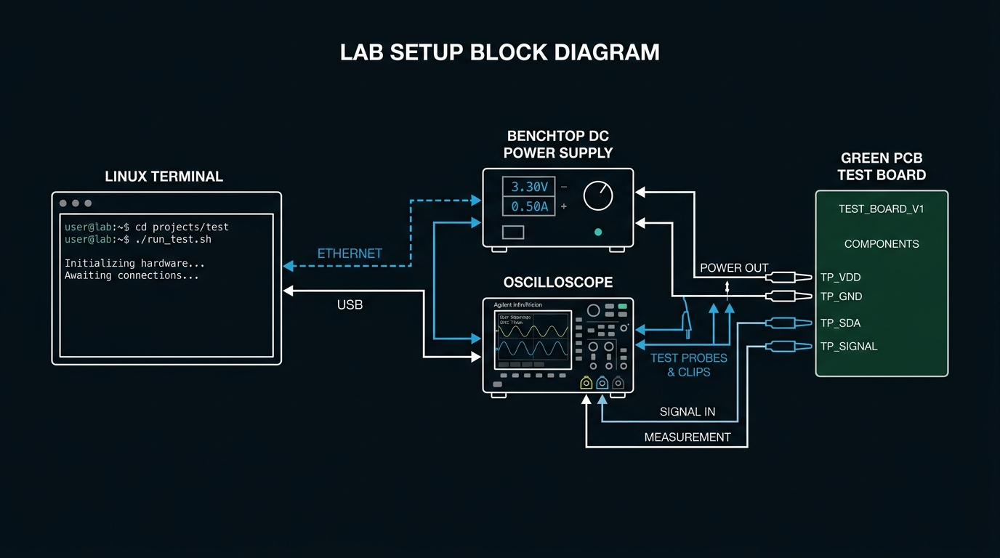
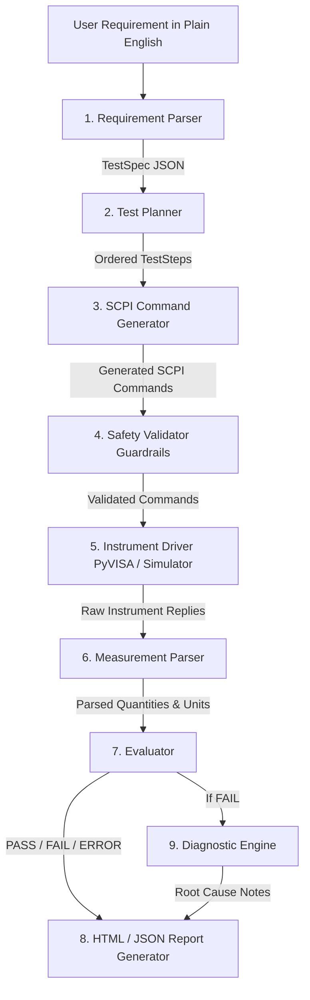

# Hardware Test Automation Agent (`hw_test_agent`)

> Convert plain-English test requirements (*"check output ripple of this 3.3V rail is under 50 mV"*) into validated SCPI command sequences, execute them over PyVISA (real hardware or simulator), evaluate limits, and generate HTML reports.

[](tests/)
[](pyproject.toml)
[](LICENSE)

---

## 📌 Lab Setup Overview

<p align="center">
  
</p>

### What it does
In hardware engineering labs, testing a Device Under Test (DUT) requires connecting benchtop instruments (power supplies, oscilloscopes, multimeters) and sending Standard Commands for Programmable Instruments (SCPI) over VISA.

Writing these scripts manually is slow and error-prone. A wrong voltage setting or missing current limit can permanently damage a prototype board.

`hw_test_agent` automates this process:
1. **Parses natural language requirements** into structured parameters (`TestSpec`).
2. **Plans instrument step recipes** (configuring limits, rails, coupling, and acquisition).
3. **Generates exact SCPI commands** using a whitelisted command database (`command_db.yaml`).
4. **Validates safety guardrails** (voltage caps, current limits, command whitelists, step order).
5. **Executes over PyVISA** (real instruments over USB/LAN/GPIB or simulated drivers).
6. **Evaluates measurements** against pass/fail limits and computes margin statistics.
7. **Generates self-contained HTML reports** with embedded waveform plots and SCPI audit logs.

---

## 📐 System Architecture



### Folder Layout
```
hw_test_agent/
├── pyproject.toml              # Package configuration and dependencies
├── README.md                   # Project documentation
├── src/hw_test_agent/
│   ├── cli.py                  # Typer CLI application (hwtest)
│   ├── agent/
│   │   ├── parser.py           # Natural language to TestSpec parser
│   │   ├── planner.py          # Step sequence planner
│   │   ├── generator.py        # SCPI command generator
│   │   ├── validator.py        # Hardware safety validator
│   │   ├── executor.py         # PyVISA execution engine
│   │   ├── evaluator.py        # Limit checking and margin math
│   │   ├── reporter.py         # HTML report generator with Matplotlib plots
│   │   └── orchestrator.py     # Execution pipeline orchestrator
│   ├── instruments/
│   │   ├── base.py             # Instrument Abstract Base Class
│   │   ├── visa_driver.py      # PyVISA physical hardware driver
│   │   ├── simulated.py        # Simulated PSU & Scope (noise & fault injection)
│   │   └── command_db.yaml     # SCPI command whitelist database
│   ├── models/
│   │   └── schemas.py          # Pydantic data models
│   ├── llm/
│   │   ├── client.py           # LLM client with structured output & mock mode
│   │   └── prompts.py          # System prompts for parser, planner, generator, diagnosis
│   └── utils/
│       ├── units.py            # Unit parsing, SI conversion, and limit checking
│       └── logging_setup.py    # Console & file audit logger
├── tests/                      # Pytest suite (40 test cases)
├── sim/                        # pyvisa-sim resource definitions
└── reports/                    # HTML reports & JSON result exports
```

---

## 🚀 Quickstart Guide

### 1. Installation

```bash
git clone https://github.com/your-username/hw_test_agent.git
cd hw_test_agent
pip install -e .
```

### 2. Running Test Requirements (CLI)

#### Check Ripple Voltage (< 50 mV)
```bash
python -m hw_test_agent.cli "check that the output ripple of this power supply is under 50 mV"
```

#### Measure Regulator DC Voltage Accuracy (3.3V ± 2%)
```bash
python -m hw_test_agent.cli "measure 3.3V DC regulator output voltage accuracy within 2%"
```

#### Measure Frequency (1 kHz)
```bash
python -m hw_test_agent.cli "measure signal output frequency of oscillator around 1 kHz"
```

#### Safety Dry Run (Validate without hardware execution)
```bash
python -m hw_test_agent.cli "check power supply current consumption is under 100 mA at 3.3V" --dry-run
```

#### Adversarial Overvoltage Test (Safety Guardrail Check)
```bash
python -m hw_test_agent.cli "set power supply voltage to 50 V and measure output" --max-voltage 12.0
```
*Output:* The Safety Validator blocks execution because `VOLT 50.0` exceeds the configured 12.0 V limit.

---

## 📊 Viewing HTML Test Reports

Each execution generates a self-contained HTML test report and JSON export in the `reports/` folder:
* **HTML Report:** [`reports/report.html`](file:///d:/project/reports/report.html)
* **JSON Result:** [`reports/result.json`](file:///d:/project/reports/result.json)

The report includes:
* **Test Status Badge:** PASS (Green), FAIL (Red), or ERROR (Yellow).
* **Primary Measurement & Margin Analysis:** Calculated delta to limits.
* **Embedded Waveform Plot:** Matplotlib PNG plot showing measured signals and limit threshold lines.
* **SCPI Command Audit Trail Table:** Timestamped log of every command sent and response received.
* **Root-Cause Diagnostic Analysis:** AI-assisted troubleshooting notes on test failures.

---

## 🔌 Connecting Real Hardware

To connect `hw_test_agent` to **physical bench instruments** (Rigol, Keysight, Siglent, Tektronix, Keithley):

### 1. Find VISA Resource Strings

Connect instruments via USB or Ethernet/LAN, then run:

```bash
python -c "import pyvisa; rm = pyvisa.ResourceManager(); print(rm.list_resources())"
```

Resource string formats:
* **USB-TMC:** `USB0::0x1AB1::0x0E11::DP8A000000001::INSTR`
* **Ethernet / LAN (VXI-11):** `TCPIP0::192.168.1.100::inst0::INSTR`
* **Raw TCP Socket:** `TCPIP0::192.168.1.100::5025::SOCKET`
* **GPIB:** `GPIB0::7::INSTR`
* **Serial / RS-232:** `ASRL1::INSTR` or `COM3`

### 2. Execute Python Script on Hardware

```python
from hw_test_agent.agent.orchestrator import Orchestrator
from hw_test_agent.instruments.visa_driver import VisaInstrument
from hw_test_agent.agent.validator import SafetyValidator

# 1. Connect physical instruments via PyVISA addresses
psu = VisaInstrument(resource_name="USB0::0x1AB1::0x0E11::DP8A000000001::INSTR")
scope = VisaInstrument(resource_name="USB0::0x0957::0x1796::MY59001234::INSTR")

# 2. Configure safety limits
validator = SafetyValidator(max_voltage=12.0, max_current=2.0)

# 3. Instantiate orchestrator & run requirement
orchestrator = Orchestrator(psu=psu, scope=scope, validator=validator)
result = orchestrator.run("check that the output ripple of this power supply is under 50 mV")

print(f"Status: {result.status}")
print(f"Report: reports/report.html")
```

---

## 🔑 LLM Provider Setup

`hw_test_agent` supports OpenAI, Gemini, custom OpenAI-compatible local APIs (Ollama / LM Studio), and an **offline mock mode** requiring no API keys.

### 1. Offline / Mock Mode (Default)
If no environment variables are set, `LLMClient` runs in mock mode for offline testing and CI workflows.

### 2. OpenAI API
```bash
set OPENAI_API_KEY=sk-proj-your-api-key
```

### 3. Local LLM (Ollama, vLLM, LM Studio)
```bash
set LLM_API_KEY=local-key
set LLM_BASE_URL=http://localhost:11434/v1
```

---

## 🛡️ Safety Guardrail Pipeline

Hardware safety is enforced through five mandatory rules:

1. **Command Whitelist:** Every command is checked against SCPI templates in `command_db.yaml`. Unrecognized SCPI strings are blocked.
2. **Dangerous Keyword Filtering:** Keywords like `CAL:`, `CALIBRATE`, `FLASH`, `ERASE`, `FORMAT`, `MEM:WRITE` are immediately rejected.
3. **Voltage & Current Limits:** Parameter bounds checks enforce max voltage (default 12.0 V) and max current (default 2.0 A).
4. **Step Ordering Enforcement:** `OUTP ON` (enabling rail output) is rejected if a current limit (`CURR`) was not configured prior.
5. **Mandatory Cleanup Guarantee:** A Python `try...finally` block guarantees `OUTP OFF` is sent on termination under all conditions.

---

## 🧪 Test Suite

Run the full pytest suite (40 test cases):

```bash
python -m pytest -v
```

```text
tests/test_end_to_end.py::test_e2e_ripple_pass PASSED                    [  2%]
tests/test_end_to_end.py::test_e2e_dc_voltage_pass PASSED                [  5%]
tests/test_end_to_end.py::test_e2e_frequency_pass PASSED                 [  7%]
tests/test_end_to_end.py::test_e2e_fault_injection_fail PASSED           [ 10%]
tests/test_end_to_end.py::test_e2e_adversarial_overvoltage_blocked PASSED [ 12%]
tests/test_evaluator.py::test_parse_measurement_float PASSED             [ 15%]
tests/test_evaluator.py::test_parse_measurement_scientific PASSED        [ 17%]
tests/test_evaluator.py::test_compute_statistics PASSED                  [ 20%]
tests/test_evaluator.py::test_detect_outliers PASSED                     [ 22%]
tests/test_parser.py::test_parse_requirement_ripple PASSED               [ 25%]
tests/test_parser.py::test_parse_requirement_dc_voltage PASSED           [ 27%]
tests/test_parser.py::test_parse_requirement_ambiguous PASSED            [ 30%]
tests/test_units.py::test_parse_quantity PASSED                          [ 75%]
tests/test_validator.py::test_validator_safe_voltage PASSED              [100%]

============================= 40 passed in 2.64s ==============================
```

---

## 📋 SCPI Reference Cheat Sheet

| Instrument | Action | SCPI Command Template |
|---|---|---|
| Power Supply | Set Voltage | `VOLT {value}` |
| Power Supply | Set Current Limit | `CURR {value}` |
| Power Supply | Output Enable | `OUTP ON` |
| Power Supply | Output Disable | `OUTP OFF` |
| Power Supply | Measure Voltage | `MEAS:VOLT?` |
| Power Supply | Measure Current | `MEAS:CURR?` |
| Oscilloscope | Set AC Coupling | `CHAN1:COUP AC` |
| Oscilloscope | Set Vertical Scale | `CHAN1:SCAL {value}` |
| Oscilloscope | Set Timebase | `TIM:SCAL {value}` |
| Oscilloscope | Measure Ripple Vpp | `MEAS:VPP? CHAN1` |
| Oscilloscope | Measure Frequency | `MEAS:FREQ? CHAN1` |

---

## 📜 License

Distributed under the MIT License. See `LICENSE` for details.
